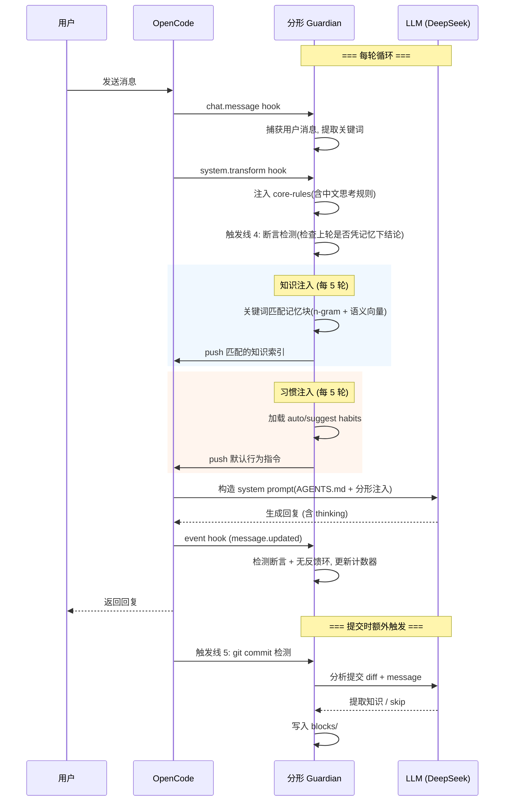

# 分形机制时序图

> 导出日期：2026-07-21

```mermaid
sequenceDiagram
    participant U as 用户
    participant OC as OpenCode
    participant F as 分形 Guardian
    participant L as LLM (DeepSeek)

    Note over F,L: === 每轮循环 ===

    U->>OC: 发送消息
    OC->>F: chat.message hook
    F->>F: 捕获用户消息, 提取关键词

    OC->>F: system.transform hook
    F->>F: 注入 core-rules(含中文思考规则)

    F->>F: 触发线 4: 断言检测(检查上轮是否凭记忆下结论)

    rect rgb(240,248,255)
        Note over F: 知识注入 (每 5 轮)
        F->>F: 关键词匹配记忆块(n-gram + 语义向量)
        F->>OC: push 匹配的知识索引
    end

    rect rgb(255,245,238)
        Note over F: 习惯注入 (每 5 轮)
        F->>F: 加载 auto/suggest habits
        F->>OC: push 默认行为指令
    end

    OC->>L: 构造 system prompt(AGENTS.md + 分形注入)
    L-->>OC: 生成回复 (含 thinking)

    OC->>F: event hook (message.updated)
    F->>F: 检测断言 + 无反馈环, 更新计数器

    OC-->>U: 返回回复

    Note over F,L: === 提交时额外触发 ===

    OC->>F: 触发线 5: git commit 检测
    F->>L: 分析提交 diff + message
    L-->>F: 提取知识 / skip
    F->>F: 写入 blocks/
```
