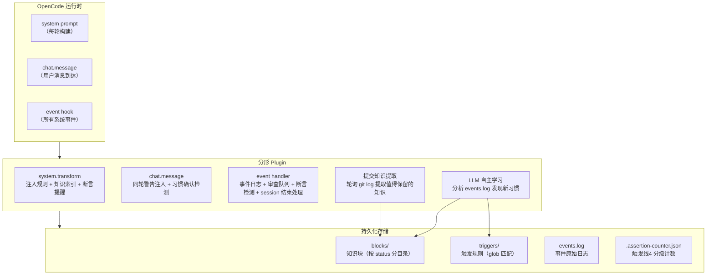
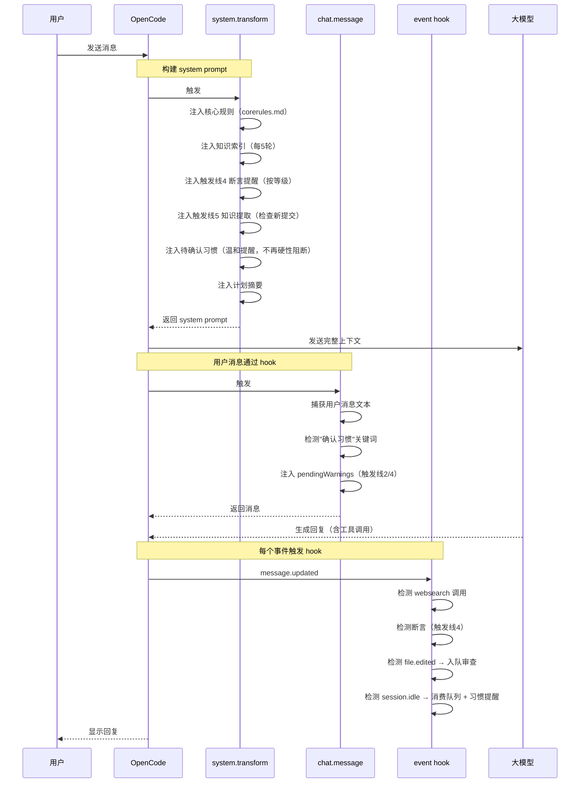
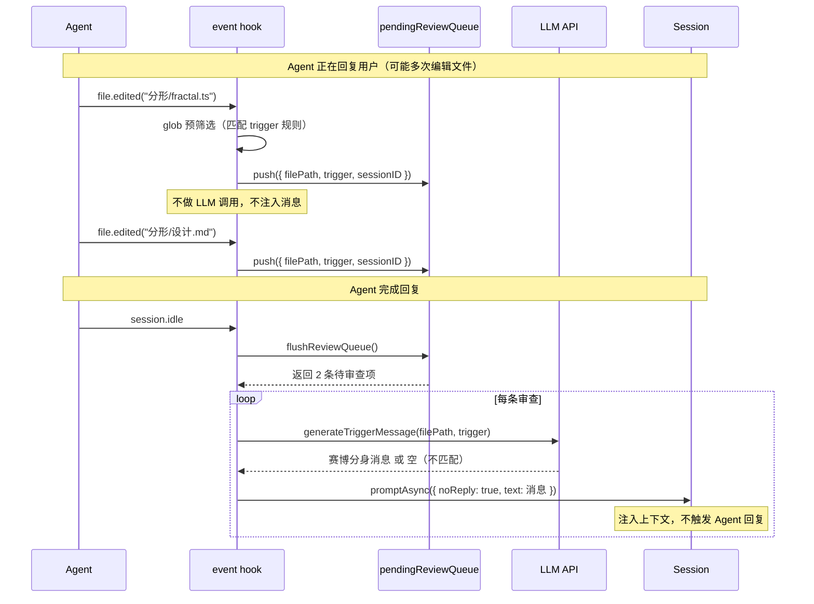
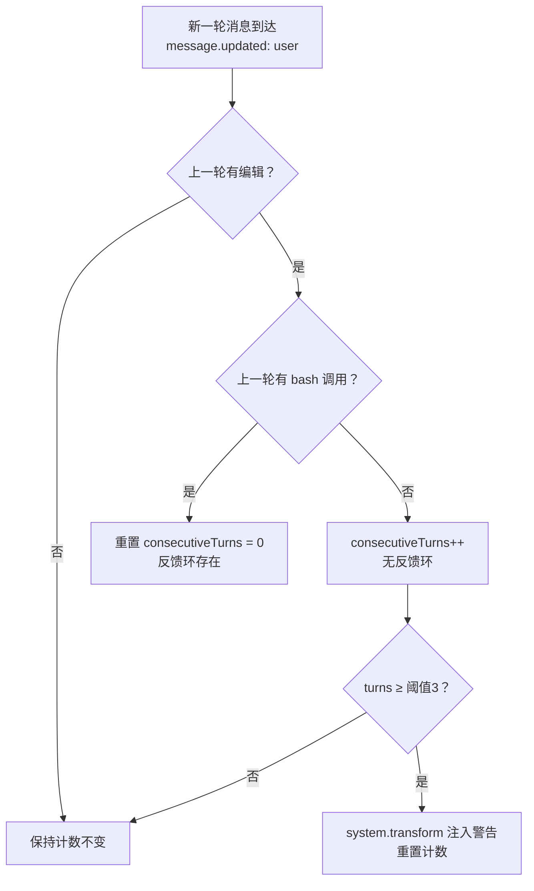
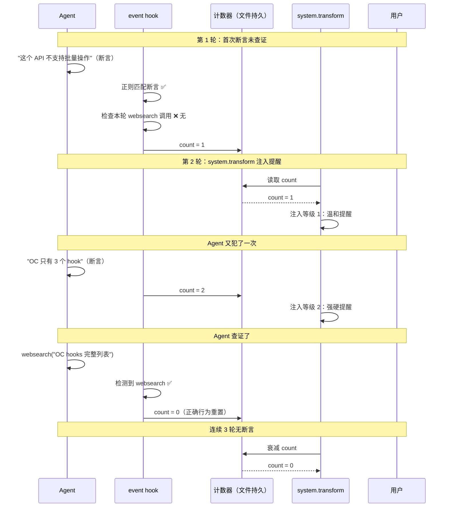
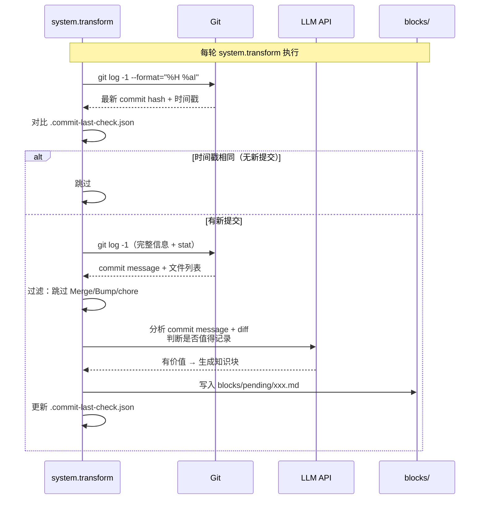
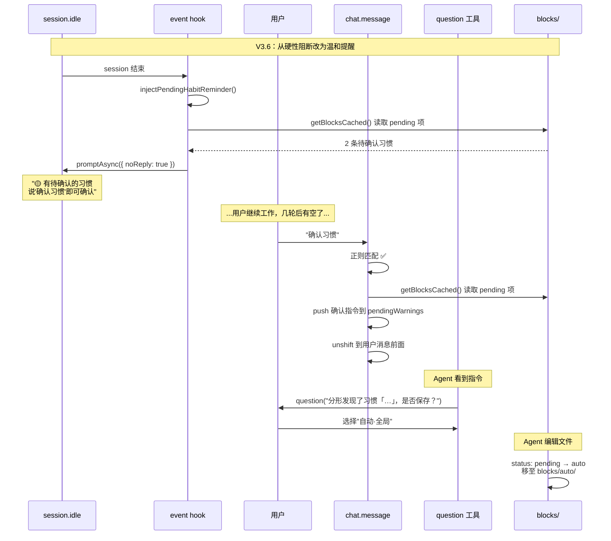
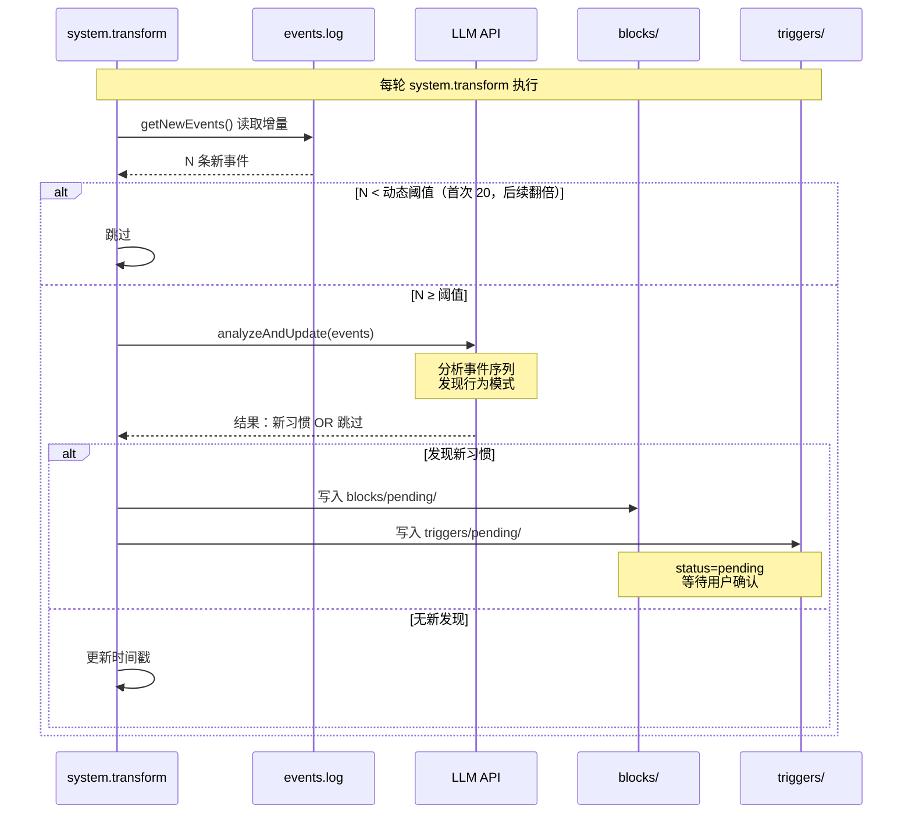
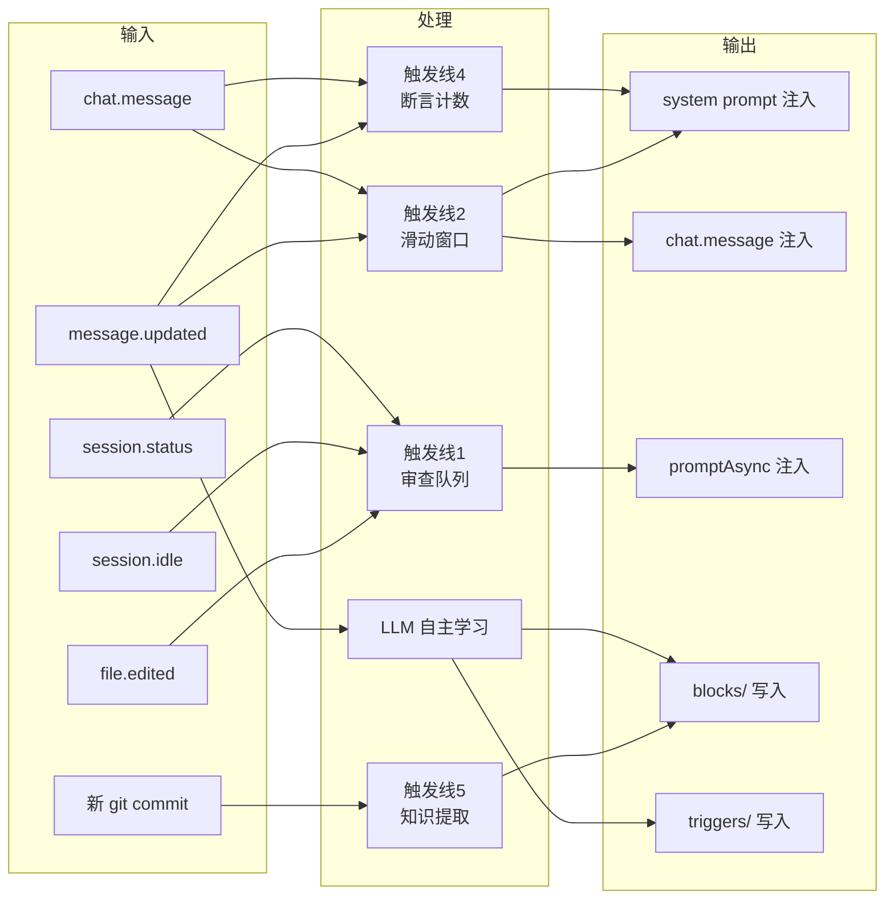

# 分形 Guardian Agent — 机制说明

> 面向人类用户的架构文档。设计决策与原理见 [设计.md](设计.md)。
> 当前版本：V3.6 | 2026-07-23

---

## 一、一句话概述

分形是一个**后台 Guardian 插件**——静默观察你在 OpenCode 中的所有操作，在五个关键场景自动介入（提醒、纠正、提取知识），不打断你的工作流。

---

## 二、整体架构



**三个 hook 入口，按执行顺序：**

| 顺序 | Hook | 做什么 |
|------|------|--------|
| 1 | `system.transform` | 构建 system prompt：注入核心规则 + 知识索引 + 触发线提醒 + 计划摘要 |
| 2 | `chat.message` | 用户消息到达：注入同轮警告（触发线2/4） + 检测"确认习惯"关键词 |
| 3 | `event` | 监听所有系统事件：记录日志 + 断言检测 + 审查队列 + session 结束处理 |

---

## 三、Hook 管道：一轮对话的完整时序



---

## 四、触发线 1：文件编辑审查

**场景**：你写了一个文件，分形检查它是否匹配某个已注册的习惯规则。

**核心改进（V3.6）**：不再在 `file.edited` 事件发生时立即注入审查——改为**队列化 + 等待 session 结束**，避免在 agent 回复过程中打断。



**三层漏斗**（仅第二、三层改为 session.idle 时执行）：

| 层 | 执行时机 | 做什么 | 耗时 | Token |
|----|---------|--------|------|-------|
| 1. glob 预筛选 | `file.edited` 事件时 | 检查文件路径是否匹配 trigger 的 glob 规则 | <1ms | 0 |
| 2. LLM 语义判断 | `session.idle` 时 | 调 LLM API 判断文件改动是否真正匹配习惯语义 | ~3s | ~200 |
| 3. 消息注入 | LLM 返回后 | `promptAsync({ noReply: true })` 注入赛博分身消息 | ~100ms | 0 |

**队列上限**：20 条。超过上限时丢弃最旧项，防止 session.idle 不触发时无限增长。

---

## 五、触发线 2：无进展循环 + 无反馈环

**场景**：Agent 连续修改代码但不执行测试，陷入"改→不行→再改→还不行"的死循环。



**检测时机**：每轮 `message.updated`（user 角色消息）时检查。

**注入方式**：下一轮 `system.transform` 中注入纯模板警告（不调 LLM）。

---

## 六、触发线 4：主动联网查证（分级升级）

**场景**：Agent 说"XX 不支持"但没有联网查证——你训过它别猜，但它还是猜了。



**分级表**：

| 等级 | count | 注入内容 | 语气 |
|------|-------|---------|------|
| 0 | 0~0 | 不注入 | — |
| 1 | 1 | "上轮你说了'不支持'但没有联网查证——先查再下结论？" | 温和 |
| 2 | 2~3 | "连续 N 次断言未查证！涉及未知 API 时先调 websearch。" | 强硬 |
| 3 | ≥4 | "本轮回复前如涉及能力判断必须先调 websearch。" | 强制 |

**计数器管理**：
- 断言 + 无查证 → `count++`
- 断言 + 有查证 → `count = 0`（重置）
- 连续 3 轮无断言 → `count = max(0, count - 1)`（衰减）
- 会话切换（sessionID 变化） → `count = 0`

---

## 七、触发线 5：提交后知识提取

**场景**：你刚提交了一个重要修复，但没记下来——下次遇到同类问题还得重新研究。



**为什么用轮询而非事件 hook？** OC 1.18.3 实测不触发 `tool.execute.before/after` 事件。`system.transform` 每轮都执行，轮询 `git log` 时间戳是唯一可靠的检测方式。

---

## 八、习惯确认：完整流程



**关键变化（V3.5 → V3.6）**：

| | V3.5 | V3.6 |
|---|------|------|
| 触发时机 | 每轮 system.transform（打断） | session.idle（温和） |
| 注入方式 | output.system.push（硬性规则） | promptAsync({ noReply: true })（上下文消息） |
| 用户交互 | 强制立即确认 | 说"确认习惯"时触发 |
| core-rules.md | 含硬性阻断规则 | 删除 |

---

## 九、记忆系统：三层存储 + 自动学习

### 存储结构

```
memories/
├── blocks/                   ← 知识块（按 status 分目录）
│   ├── pending/              ← 待用户确认
│   │   └── edit-then-review.md
│   ├── auto/                 ← 已确认，Agent 自动执行
│   │   └── scss-format-on-save.md
│   └── suggest/              ← 观察中，Agent 参考
│       └── prefer-fetch-over-curl.md
├── triggers/                 ← 触发规则（按 status 分目录）
│   ├── pending/
│   ├── auto/
│   └── suggest/
├── events.log                ← 事件原始日志
├── debug.log                 ← 诊断日志
├── .assertion-counter.json   ← 触发线4 分级计数
└── .commit-last-check.json   ← 触发线5 上次提交时间戳
```

### LLM 自主学习流程



**动态阈值**：首次 20 条，第 N 次 20 × 2^N 条（上限 400）。

---

## 十、注入频率控制

并非所有内容每轮都注入——分级控制减少 system prompt 膨胀：

| 内容 | 频率 | 理由 |
|------|------|------|
| 核心规则（core-rules.md） | 每轮 | Agent 身份/行为底线 |
| 断言提醒（触发线4） | 每轮（当 count > 0） | 紧急，需立即纠正 |
| 联网查证规则 | 每轮 | 预防性规则 |
| 知识索引（knowledge） | 每 5 轮 | 量大，可节流 |
| 已确认习惯（auto） | 每 5 轮 | 已内化，不需要高频 |
| 观察中习惯（suggest） | 每 5 轮 | 不确定，低频提示 |
| 计划摘要 | 每轮 | 导航信息，轻量 |
| 无反馈环警告（触发线2） | 触发时 1 次 | 告警后重置 |

**关键词命中例外**：即使用户消息命中了 knowledge 关键词，非 nudge 轮也会立即注入匹配的 knowledge 项。

---

## 十一、数据流全景



---

## 十二、关键常量速查

| 常量 | 值 | 用途 |
|------|-----|------|
| `NUDGE_INTERVAL` | 5 | knowledge/habits 注入间隔（轮） |
| `ANALYSIS_THRESHOLD` | 20 | 首次 LLM 自主学习阈值（事件数） |
| `ANALYSIS_THRESHOLD_MAX` | 400 | 自主学习阈值上限 |
| `NO_FEEDBACK_THRESHOLD` | 3 | 无反馈环告警阈值（连续 edit 无 bash） |
| `PENDING_QUEUE_MAX` | 20 | 触发线1 审查队列上限 |
| `BLOCKS_CACHE_TTL` | 5000ms | mergeBlocksAndTriggers 缓存有效期 |
| `ASSERTION_THRESHOLDS` | 1,3,5 | 触发线4 分级阈值（可自定义） |

---

> 技术细节与源码实现见 [设计.md](设计.md) 和 `fractal.ts`。
