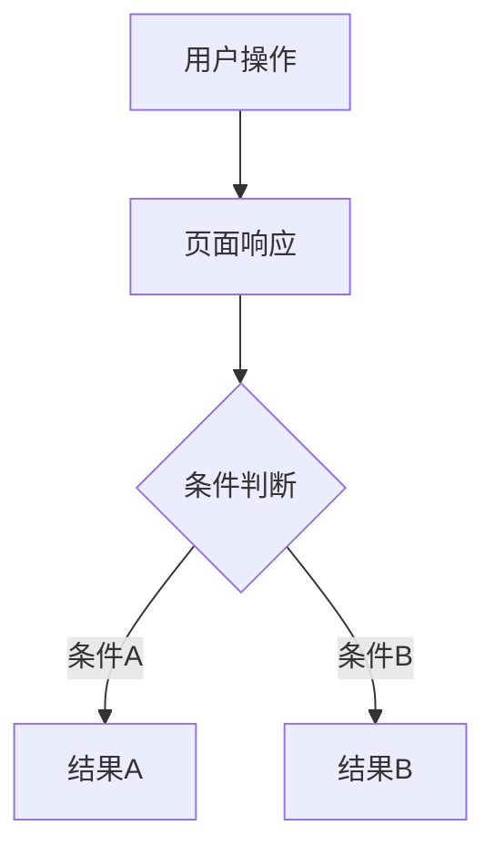

# [功能名称] — 原型文档

> 版本：v1.0
> 日期：YYYY-MM-DD
> 作者：产品经理
> 关联方案：[xxx-设计方案.md](./xxx-设计方案.md)

---

## 一、功能概述

[一段话描述这个功能做什么、给谁用]

**核心规则：**

| 规则 | 说明 |
|------|------|
| [规则项] | [一句话说明] |

---

## 二、用户场景

### 场景 A：[场景名]

> [角色]在[什么情况下]，[做了什么操作]，[得到什么结果]。

### 场景 B：[场景名]

> ...

> 用户场景用故事化叙述，让非技术人员也能读懂。

---

## 三、页面原型

> 每个页面原型 = **ASCII 示意图**（直观感受布局）+ **结构化表格**（精确描述元素/条件/交互）

### 3.1 [页面名] — [模式/状态]

**页面：** `[路由]` / `[文件路径]`

```
[ASCII 页面示意图 — 体现主要元素和布局]
```

| 区域 | 元素 | 展示条件 | 交互 |
|------|------|----------|------|
| [区域名] | [元素描述] | [条件/始终] | [点击后行为] |

### 3.N [弹窗/子页面]

**入口：** [从哪里进入]

| 区域 | 元素 | 内容/数据来源 |
|------|------|--------------|

---

## 四、交互流程

### 4.1 正常流程



> 流程图用 mermaid，不要用 ASCII 字符画。

### 4.2 取消/退出流程

[一句话描述或简单流程图]

### 4.3 异常分支

| 节点 | 异常 | 表现 |
|------|------|------|
| [流程节点] | [异常情况] | [用户看到什么] |

---

## 五、页面状态矩阵

| 页面 | 状态 | 条件 | 展示 |
|------|------|------|------|
| [页面] | [状态名] | [触发条件] | [展示内容] |

> 覆盖所有可能的状态组合，包括空态、加载态、错误态、边界态。

---

## 六、边界与约束

| 边界项 | 约束 |
|--------|------|
| [边界项] | [约束说明] |

> 包括：字段约束、并发控制、浏览器兼容、权限边界、已知缺陷等。

---

## 七、测试要点

### 7.1 功能测试

| 编号 | 测试场景 | 前置条件 | 操作步骤 | 预期结果 |
|------|----------|----------|----------|----------|
| F-01 | [场景] | [条件] | [步骤] | [预期] |

### 7.N [维度]

| 编号 | 测试场景 | 前置条件 | 操作步骤 | 预期结果 |
|------|----------|----------|----------|----------|
| | | | | |

> 测试维度建议：功能测试 / 权限与安全 / 关键外部依赖（如 CFCA） / 数据同步 / 异常场景 / 审计日志 / 缓存 / 兼容性

---

## 八、代码索引

### 前端

| 功能点 | 文件 | 关键位置 |
|--------|------|----------|
| [功能点] | [文件路径] | [行号或关键代码段] |

### 后端

| 功能点 | 文件 | 关键位置 |
|--------|------|----------|
| [功能点] | [文件路径] | [方法名或行号] |

### 涉及表

| 表 | 操作 | 说明 |
|----|------|------|

---

## 九、变更记录

| 版本 | 日期 | 变更内容 | 作者 |
|------|------|----------|------|
| v1.0 | YYYY-MM-DD | 初始版本 | 产品经理 |
