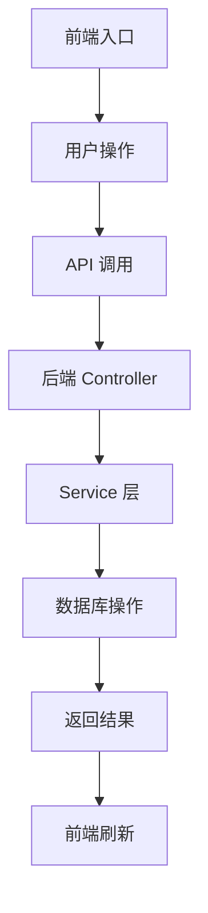
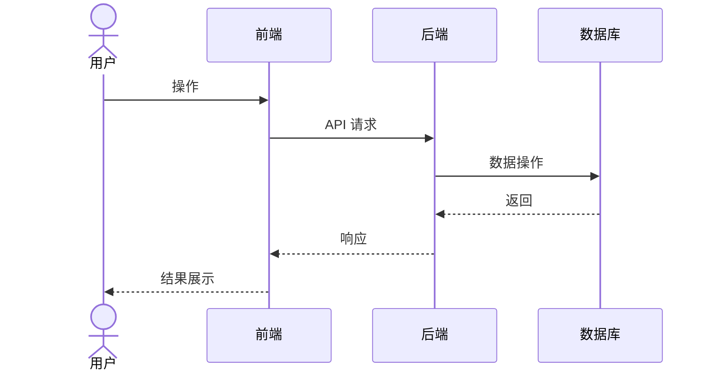

# [功能名称] — 功能设计方案

> 版本：v1.0
> 日期：YYYY-MM-DD
> 作者：[角色]
> 状态：待评审

---

## 一、需求背景

### 1.1 现状

[描述当前系统的不足或缺失的能力，说明为什么要做这个功能]

### 1.2 用户故事

| 场景 | 用户角色 | 需求描述 |
|------|----------|----------|
| [场景名] | [角色] | [一句话描述需求] |

### 1.3 范围

[明确本次覆盖什么、不覆盖什么]

| 角色 | 可操作范围 | 本次是否覆盖 |
|------|-----------|-------------|
| [角色A] | [操作描述] | ✅ / ❌ |

---

## 二、架构设计

### 2.1 整体数据流



### 2.2 关键设计决策

| 决策点 | 选择 | 理由 |
|--------|------|------|
| [决策项] | [选择方案] | [为什么这样选] |

> 设计决策表是方案的核心，每个决策项必须在"选择"和"理由"中讲清楚。

---

## 三、后端设计

### 3.1 新增/修改 DTO

**文件：** `[模块路径]/dto/[子包]/[DtoName].java`

```java
// DTO 代码，包含：
// - 字段列表 + @ApiModelProperty 注解
// - @Valid 校验注解（@Size/@NotNull/@Pattern 等）
// - 不可变更字段用注释标明
```

> 注意项：DTO 与 Entity 字段类型一致性校验；LocalDate→Date 转换策略说明；全局异常处理器前提条件。

### 3.2 Controller — [职责描述]

**文件：** `[模块路径]/controller/[模块]/[ControllerName].java`

```java
// Controller 方法代码，体现：
// - 前置校验
// - 委托 Service
// - 事务后操作（如缓存刷新）
```

### 3.3 Service 接口声明

**文件：** `[模块路径]/service/[模块]/[IServiceName].java`

```java
// 方法签名 + Javadoc
```

### 3.4 Service 实现 — 事务边界

**文件：** `[模块路径]/service/impl/[模块]/[ServiceImplName].java`

```java
// 实现代码，体现：
// - @Transactional 边界说明
// - 核心业务逻辑
// - 私有辅助方法
```

### 3.5 审计日志（如涉及敏感数据）

| 要点 | 说明 |
|------|------|
| 写入机制 | 复用已有服务/新建 |
| 查看方式 | 已有页面/待补充 |
| 字段映射 | 写入了哪些字段 |
| 脱敏规则 | 哪些字段需脱敏及规则 |

---

## 四、前端设计

### 4.1 新增 API

**文件：** `src/api/page/[模块名].ts`

```typescript
// API 函数定义
```

### 4.2 路由配置

**文件：** `src/router/route.ts`

[是否需要修改路由，如不需要则标注"无需修改"]

### 4.N 页面改造

对每个涉及页面，按以下结构描述：

**文件：** `src/views/[模块]/[页面].vue`

**改造点：** 模板变更（关键标签 + 条件渲染）+ Script 变更（新增变量/函数/生命周期）

```vue
<!-- 关键模板代码 -->
```

```typescript
// 关键 Script 代码
```

### 4.N+1 权限配置（如需要）

| 权限标识 | 用途 | 位置 |
|----------|------|------|

---

## 五、数据库变更

**是否需要新增表/字段**。涉及的表：

| 表 | 操作 | 说明 |
|----|------|------|

---

## 六、文件变更清单

### 后端

| 操作 | 文件 | 说明 |
|------|------|------|
| 新增/修改 | [路径] | [说明] |

### 前端

| 操作 | 文件 | 说明 |
|------|------|------|
| 新增/修改 | [路径] | [说明] |

---

## 七、关键流程

### 7.1 时序图



### 7.2 异常流程

| 异常场景 | 前端处理 | 后端处理 |
|----------|----------|----------|
| [场景] | [用户看到什么] | [后端怎么处理] |

---

## 八、测试要点

| 测试场景 | 前置条件 | 操作 | 预期结果 |
|----------|----------|------|----------|
| [场景] | [条件] | [步骤] | [预期] |

---

## 九、风险与边界

| 风险 | 等级 | 应对措施 |
|------|------|----------|
| [风险描述] | 高/中/低/已消除 | [怎么应对] |

---

## 十、实施计划

| 阶段 | 任务 | 预估工时 |
|------|------|----------|
| 后端 | [任务] | [h] |
| 前端 | [任务] | [h] |
| 联调 | 前后端联调 + 自测 | [h] |
| 测试 | 用例编写 + 执行 | [h] |
| **合计** | | **[X]h** |

---

## 十一、变更记录

| 版本 | 日期 | 变更内容 | 作者 |
|------|------|----------|------|
| v1.0 | YYYY-MM-DD | 初始版本 | [作者] |
